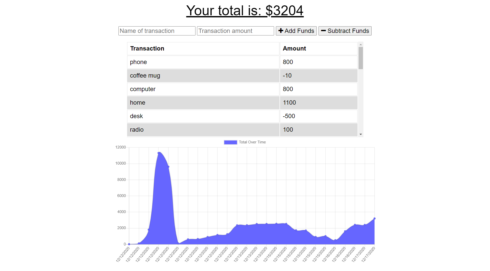

# Budget-Tracker-PWA
This aplication is a budget tracker that allows users to add expenses and deposits so they can keep track of their funds. This app is a PWA which allows the users to use the app while not connected to inter net or if they are on a slow connection without losing their functionality.

## Tools and languages used
1. Manifest.json to make a PWA
2. InedexDB to kep track of databse while offline
3. Service worker to keep track of cache files while offline
4. MongoDB Atlas to allow for deployment to Heroku

## How to use
[Click here to launch th eapplication](https://blooming-lake-53224.herokuapp.com/) and start saving some money!!

